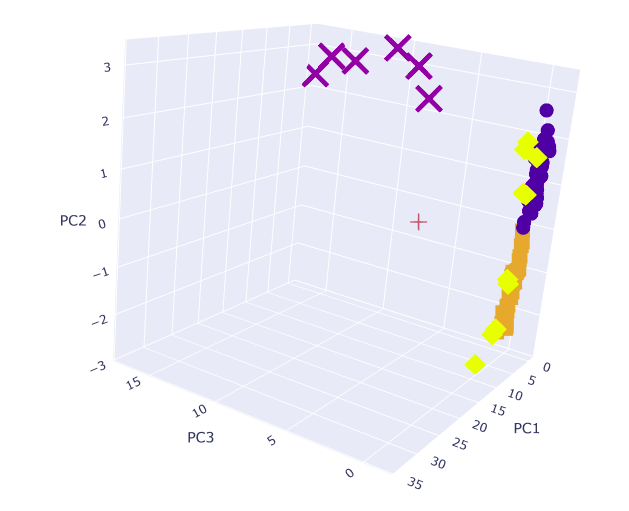
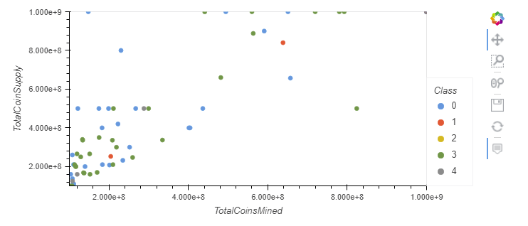
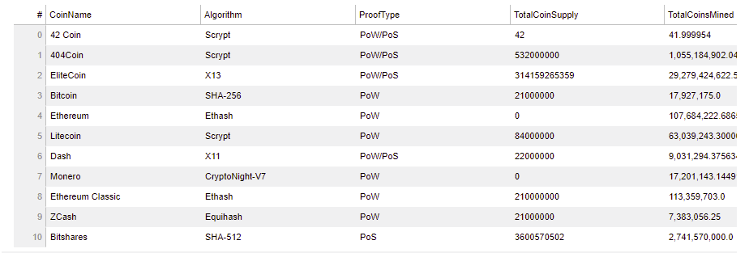

<h1 align="center">Clustering Crypto</h1>

    
        
        <section> <b>By: Ebad Salehi </b> </section>

  

<h2> Background </h2>

As a Senior Manager at the Advisory Services team on a Big Four firm. One of your most important clients, a prominent investment bank, is interested in offering a new cryptocurrencies investment portfolio for its customers, however, they are lost in the immense universe of cryptocurrencies. They ask you to help them make sense of it all by generating a report of what cryptocurrencies are available on the trading market and how they can be grouped using classification. 
 

<h2> Process </h2>

<ul>
    <li><u>Data Preprocessing:</u> Prepare data for dimension reduction with PCA and clustering using K-Means.
<li><u>Reducing Data Dimensions Using PCA:</u> Reduce data dimension using the PCA algorithm from sklearn.
    
 

<li><u>Clustering Cryptocurrencies Using K-Means:</u> Predict clusters using the cryptocurrencies data using the KMeans algorithm from sklearn.
    
<li><u>Visualizing Results:</u> Create some plots and data tables to present your results.  
    
 

     
    
 

 

<h2> Files </h2>

    
[Crypto Clustering](crypto_clustering.ipynb)
 

<h2> Technologies Used: </h2>

   - hvplot
   - matplotlib  
   - Pandas
   - Python
   - API     
   - Jupyetr notebook
   - Sklearn

(<a href="#top">↥ back to top</a>)

 
